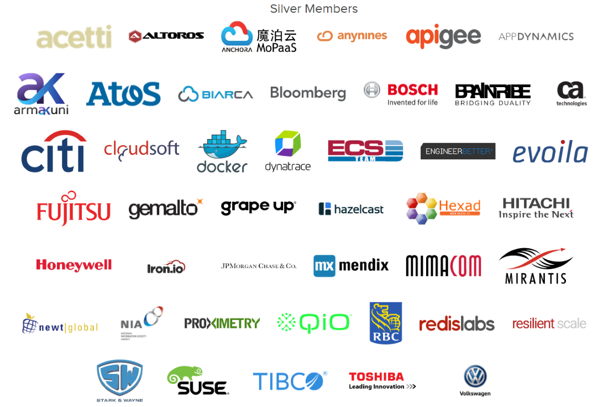

<!-- .slide: class="titlePage" -->

## Intro to Cloud Foundry

#### A guide to the Clouds

Note:
Welcome and Introduction
Thank Hybris
Mention shirts

---

## What is Cloud Foundry

Let's take a look

Note:
Show in a demo
- show slides running locally
- push to CF
- change locally
- push again

---

## Cloud Foundry is a PaaS
 

SaaS - Features <!-- .element: class="fragment boxes" data-fragment-index="3" -->

PaaS - Applications <!-- .element: class="boxes" -->

IaaS - VMs <!-- .element: class="fragment boxes" data-fragment-index="2" -->

Bare Metal - CPU & Memory<!-- .element: class="fragment boxes" data-fragment-index="1" -->

Note:
- Droplet is read-only and is cached to facilitate quick scaling and recovery
- Droplet generated with Buildpack
- Warden is similar to Docker, uses same Linux Kernel tools (cgroups, namespaces)

---

### Quick History Lesson

* 2007 Heroku and Google App Engine
* 2010 Cloud Foundry by VMWare
* 2012 Pivotal takes over
* 2014 Cloud Foundry Foundation
* 2015 CF sells like "warme Semmeln"

Note:
- First PaaS (Heroku, Google App Engine)
- Inception of CF
- Pivotal
- Foundation

---

### Foundation #1

---

### Foundation #2

---

## Features

* Scaling

Note:
Now let's take a look at the core features of Cloud Foundry. Let's start with scaling, since I like that best.

--

### Scaling

1. Show me
2. Rapid scaling with pre-compiled droplet
3. Built-in load balancing
4. Auto-scaling (maybe)

Note:

--

## How does it work

--

## How does it work #1

--

## How does it work #2

---

## Features

* Scaling
* High Availability

Note:

--

### High Availability

1. I only believe it when I see it
2. [4 layers](http://youtu.be/D7BjBIQZDII)

Note:

---

## Features

* Scaling
* High Availability
* Intelligent Service bindings

Note:

--

### Service Bindings

1. Yes, it's true, here is a demo
2. Grow your service based on environment
3. Large number of offered services
4. Develop your own

Note:

---

## Features

* Scaling
* High Availability
* Intelligent Service bindings
* Log aggregation and monitoring

Note:

--

### Log aggregation and monitoring

1. Proof
2. Logs from all instances and the system
3. Includes access logs
4. Integrates with Splunk et al

Note:
Show logging output from all components
Integration with Splunk et al
Basic stats in the console with more to come

---

## Features

* Scaling
* High Availability
* Intelligent Service bindings
* Log aggregation and monitoring
* [Mulit-language and framework support](https://github.com/kztanaka/buildpack-opensource-cobol)
* User, role, and access management
* Security (of course...)

Note:

---

## The Future

* Diego and Lattice
* Firehose
* Intelligent routing
* More Security
* ...

--

## Diego

* Rewrite of runners
* Enables support for Docker and .Net
* Better distribution and healing of instances

--

## Lattice

* Standalone scheduler extracted from Diego for Docker images
* Compare to Kubernetes, Marathon/Mesos
* https://github.com/pivotal-cf-experimental/lattice

Note:
- Very young project
- Think of it as a Cloud Foundry lite

---

## Containers vs Buildpacks

*Containers* are better when:

* Developers require more control
* Developers know Ops/Docker
* Time to Market is important

---

## Containers vs Buildpacks

*Buildpacks* are better when:

* Ops requires more control
* Developers focus on application
* Low maintenance cost is important

Note:
- I am biased towards Buildpacks, but there are good reasons to push containers

---

## Next talk

Topic - you decide:

* Architecture Deep Dive
* Docker and CF
* Running CF
* Microservices and CF
* Developing for the Cloud - Pro Tips

Note:
- If you want to understand the internals of Cloud Foundry
- How can you use Docker and CF together
- How do we run PWS
- Very popular topic and there are lots os interesting strategies and patterns
- How do I write an app that works well on CF, plus some ideas about running it like Blue-Green-Deployments, Microservices, Netflix OSS...

---

## Thank you

May the Clouds be with you

jtuchscherer@pivotal.io
