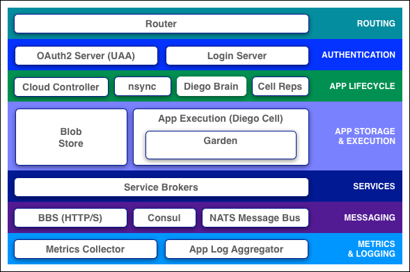

<!-- .slide: class="titlePage" -->

## Intro to Cloud Foundry

#### A guide to the Clouds

Note:
Welcome and Introduction
This is our 5th meetup. 314 CloudFounders.
Ask for job opportunities
Thank Hybris and Anynines

---

## What is Cloud Foundry
 
here is my source code  
run it on the cloud for me  
I do not care how<!-- .element: class="fragment boxes" data-fragment-index="1" -->

*Cloud Foundry Haiku - Onsi Fakhouri, Pivotal*<!-- .element: class="fragment boxes" data-fragment-index="2" -->

Note:
Onsi Fakhouri is VP of Engineering for Cloud Foundry at Pivotal
May 2015 https://twitter.com/onsijoe/status/598235841635360768

--

Let's take a look

Note:
Show in a demo
https://github.com/vchrisb/cf-HelloWorld

--

## Cloud Foundry is a PaaS

SaaS <- consume <!-- .element: class="fragment boxes" data-fragment-index="3" -->

PaaS <- build <!-- .element: class="fragment boxes" data-fragment-index="2"-->

IaaS <- host <!-- .element: class="fragment boxes" data-fragment-index="1" -->

Note:
PaaS or Cloud Native Platform

--

### Quick History Lesson

* 2007 Heroku and Google App Engine <!-- .element: class="fragment" data-fragment-index="1" -->
* 2009 VMWare buys SpringSource <!-- .element: class="fragment" data-fragment-index="2" -->
* 2011 Cloud Foundry OSS <!-- .element: class="fragment" data-fragment-index="3" -->
* 2012 Pivotal spin out<!-- .element: class="fragment" data-fragment-index="4" -->
* 2014 Cloud Foundry Foundation <!-- .element: class="fragment" data-fragment-index="5" -->
* 2015 Major rewrite -> Diego <!-- .element: class="fragment" data-fragment-index="6" -->
* 2016 many large customers speak publicly about CF <!-- .element: class="fragment" data-fragment-index="7" -->

Note:
- Cf developed by VMware, code name B29
- VCAP = VMware's Cloud Application Platform
- Pivotal changed engineering to pairing and test driving
- Foundation has lots of money and weight
- 2016: Bosch, Volkswagen, Siemens, Allianz, Rakuten, ...

---

## The Cloud Foundry Foundation

*is an independent not-for-profit Linux Foundation Collaborative Project. Our purpose is to make Cloud Foundry the leading application platform for cloud computing worldwide.*

--

### Platinum and Gold Members

Note:
- SAP
- IBM (co-opetition)
- buch of other big names

--

### Silver Members

Note:
- Docker
- Anynines
- Volkswagen

--

### Commercial Distributions

* Pivotal Cloud Foundry (PCF)
* IBM Bluemix
* HPE Helion Stackato

Note:

---

## Cloud Foundry Architecture

Note:
https://docs.cloudfoundry.org/concepts/architecture/

--

## BOSH

*BOSH is a project that unifies release engineering, deployment, and lifecycle management of small and large-scale cloud software. BOSH can provision and deploy software over hundreds of VMs. It also performs monitoring, failure recovery, and software updates with zero-to-minimal downtime.*

Note:
http://bosh.io/

--

## Cloud Provider Interfaces (CPI) 

* AWS
* Azure
* OpenStack
* vSphere
* vCloud
* Softlayer
* Google Compute Engine
* RackHD (Bare Metal)

---

## Features

* Application lifecycle

Note:

--

### Deployment

* Builpacks
* Cloud Foundry CLI
* concourse 
* Show me "cf push"

Note:
- https://github.com/vchrisb/cf-HelloWorld
- https://concourse.ci/

--

## How does it work

Note:
https://docs.cloudfoundry.org/concepts/how-applications-are-staged.html

--

### Updating

* Show me a Blue-Green Deployment
* Built-in routing and load balancing

Note:
"blue_green_deployment.txt"
https://docs.cloudfoundry.org/devguide/deploy-apps/blue-green.html

--

## How does it work

Note:

--

### Scaling

* Show me app scaling
* Rapid scaling with pre-compiled droplet
* Auto-scaling

Note:
https://docs.cloudfoundry.org/devguide/deploy-apps/cf-scale.html

---

## Features

* Application lifecycle
* **High Availability**

Note:

--

### High Availability

* Availability Zones
* Scalable Components
* Health Management for App Instances
* Process Monitoring
* Resurrection for VMs

Note:
https://docs.cloudfoundry.org/concepts/high-availability.html

---

## Features

* Application lifecycle
* High Availability
* **Service bindings**

Note:

--

### Service Bindings

1. show me the marketplace
2. Grow your service based on environment
3. Large number of offered services
4. Develop your own Service Broker

Note:

---

## Features

* Application lifecycle
* High Availability
* Intelligent Service bindings
* **Log aggregation and monitoring**

Note:

--

### Log aggregation and monitoring

1. Proof
2. Logs from all instances and the system
3. Includes access logs
4. Integrates with Splunk, ELK Stack, ...

Note:
Show logging output from all components
cf logs
cf events

---

## Features

* Application lifecycle
* High Availability
* Intelligent Service bindings
* Log aggregation and monitoring
* Mulit-language and framework support
* User, role, and access management
* Security
* many more

Note:

---

## PCF Dev

Note:

--

### Prerequisites

* CF CLI
* VirtualBox: 5.0+
* At least 3 GB of available memory
* Internet connection (or Dnsmasq or Acrylic) required for wildcard DNS resolution

Note:
https://github.com/pivotal-cf/pcfdev

--

### Get ready

* Downlad and Install PCF Dev CLI Plugin  
    * https://github.com/pivotal-cf/pcfdev
* Run "cf dev start"
* Push your first app

---

## What's coming to CF

* v3 API<!-- .element: class="fragment" data-fragment-index="1" -->
* Persistent Storage<!-- .element: class="fragment" data-fragment-index="2" -->
* Container Networking<!-- .element: class="fragment" data-fragment-index="3" -->
* BOSH "2.0"<!-- .element: class="fragment" data-fragment-index="4" -->
* isolation segments<!-- .element: class="fragment" data-fragment-index="5" -->
* Bits Service<!-- .element: class="fragment" data-fragment-index="6" -->
* Abacus<!-- .element: class="fragment" data-fragment-index="7" -->
* ...<!-- .element: class="fragment" data-fragment-index="8" -->

Note:

v3 API: 
Running one-off tasks on Cloud Foundry
Applications consisting of several processes via a Procfile
Direct access to application packages and droplets

BOSH "2.0":
the heart of the Cloud Foundry multi-cloud promise

Abacus:
usage metering and aggregation

---

## Thank you

Christopher.Banck@dell.com  
@chrisbanck  
https://github.com/vchrisb
