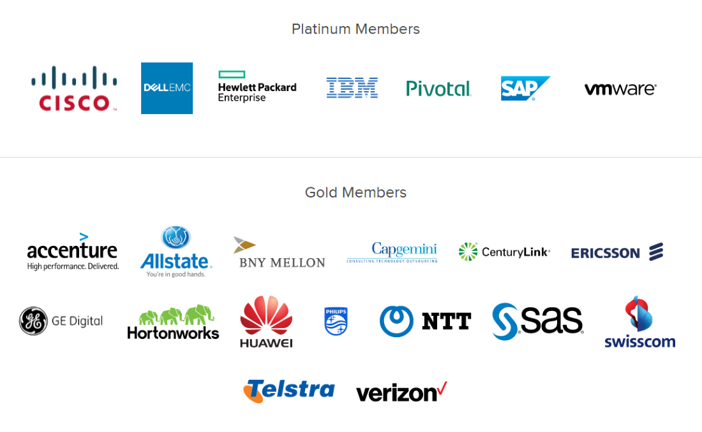

<!-- .slide: class="titlePage" -->

## Intro to Cloud Foundry

#### A guide to the Clouds

Note:
Welcome and Introduction
This is our first meetup. Happy about the crowd. Trying to do this monthly, but have to see that there is no overlap to the other meetups, microservices, docker, core os.  
Ask for job opportunities
Thank Hybris
Mention shirts

---

## What is Cloud Foundry

Let's take a look

Note:
Show in a demo
- show slides running locally
- push to CF
- change locally
- push again

This is hosted Cloud Foundry (public), you can also install it

---

## Cloud Foundry is a PaaS
 

SaaS - Features <!-- .element: class="fragment boxes" data-fragment-index="4" -->

Platform - Applications <!-- .element: class="fragment boxes" data-fragment-index="3"-->

Infrastructure - VMs <!-- .element: class="fragment boxes" data-fragment-index="2" -->

Bare Metal - Server<!-- .element: class="fragment boxes" data-fragment-index="1" -->

Note:

---

### Quick History Lesson

 

* 2007 Heroku and Google App Engine <!-- .element: class="fragment" data-fragment-index="1" -->
* 2009 Cloud Foundry bought by VMWare <!-- .element: class="fragment" data-fragment-index="2" -->
* 2011 Cloud Foundry OSS <!-- .element: class="fragment" data-fragment-index="3" -->
* 2012 Pivotal takes over <!-- .element: class="fragment" data-fragment-index="4" -->
* 2014 Cloud Foundry Foundation <!-- .element: class="fragment" data-fragment-index="5" -->
* 2015 CF "geht weg wie warme Semmeln" (sells well) <!-- .element: class="fragment" data-fragment-index="6" -->

Note:
- I remember my first interaction with GAE, appcfg. mind blowing
- CF incepted by Derek Collison and then bought by VMWare
- Pivotal changed engineering to pairing and test driving
- Foundation has lots of money and weight

---

### Foundation #1

Note:
- Docker
- Anynines

---

### Foundation #2

Note:
- SAP
- IBM (co-opetition)
- buch of other big names

---

## Features

* Scaling

Note:
Now let's take a look at the core features of Cloud Foundry. Let's start with scaling, since I like that best.

--

### Scaling

1. Show me
2. Rapid scaling with pre-compiled droplet
3. Built-in load balancing
4. Auto-scaling (maybe)

Note:

--

## How does it work #1

--

## How does it work #2

---

## Features

* Scaling
* High Availability

Note:

--

### High Availability

1. I only believe it when I see it
2. [4 layers](http://youtu.be/D7BjBIQZDII)

Note:

---

## Features

* Scaling
* High Availability
* Intelligent Service bindings

Note:

--

### Service Bindings

1. Yes, it's true, here is a demo
2. Grow your service based on environment
3. Large number of offered services
4. Develop your own

Note:

---

## Features

* Scaling
* High Availability
* Intelligent Service bindings
* Log aggregation and monitoring

Note:

--

### Log aggregation and monitoring

1. Proof
2. Logs from all instances and the system
3. Includes access logs
4. Integrates with Splunk et al

Note:
Show logging output from all components
Integration with Splunk et al
Basic stats in the console with more to come

---

## Features

* Scaling
* High Availability
* Intelligent Service bindings
* Log aggregation and monitoring
* [Mulit-language and framework support](https://github.com/kztanaka/buildpack-opensource-cobol)
* User, role, and access management
* Security (of course...)

Note:

---

## What's coming to CF

* Diego and Lattice
* Firehose
* Intelligent routing
* More Security (as always)
* ...

--

## Diego

* Rewrite of DEA
* Enables support for Docker and .Net
* Better distribution and healing of instances

--

## Lattice

* Standalone scheduler extracted from Diego for Docker images
* Compare to Kubernetes, Marathon/Mesos
* https://github.com/pivotal-cf-experimental/lattice

Note:
- Very young project
- Think of it as a Cloud Foundry lite

---

## Next talk

Topic - you decide:

* Architecture Deep Dive
* ~~Docker and CF~~
* Running, operating, and monitoring CF
* Microservices and CF
* Developing for the Cloud - Pro Tips
* Comparison with other PaaS

Note:
- If you want to understand the internals of Cloud Foundry
- How do we run PWS
- Very popular topic and there are lots os interesting strategies and patterns
- How do I write an app that works well on CF, plus some ideas about running it like Blue-Green-Deployments, Microservices, Netflix OSS...

---

## Thank you

May the Clouds be with you

jtuchscherer@pivotal.io
